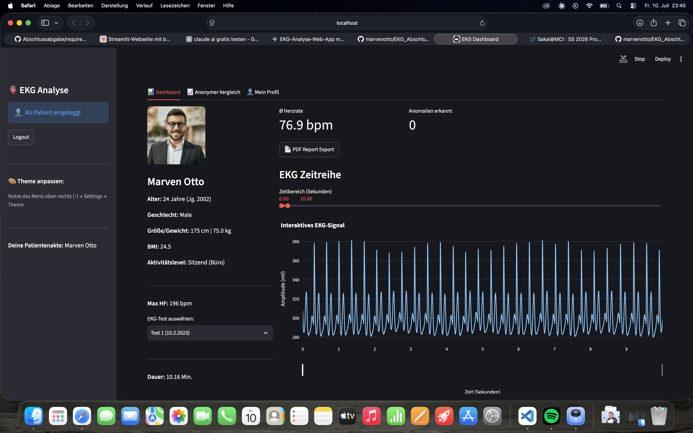
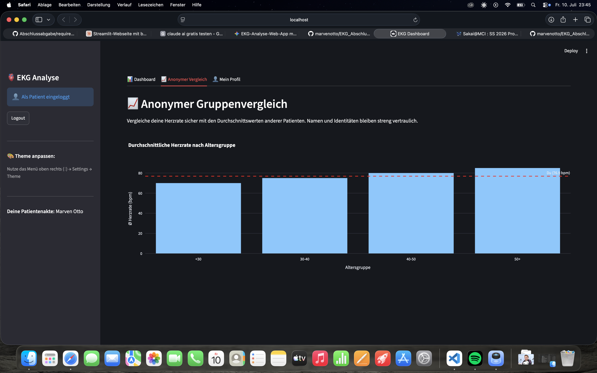
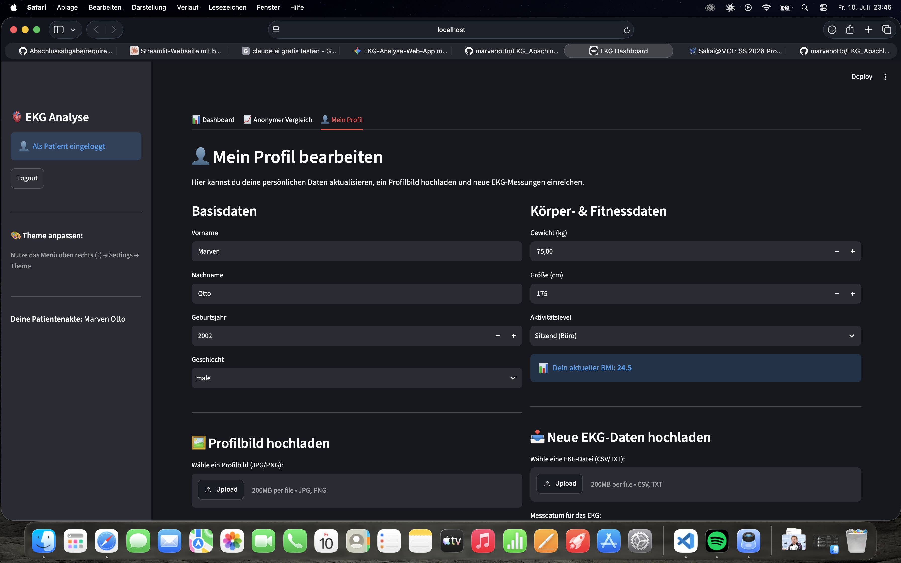
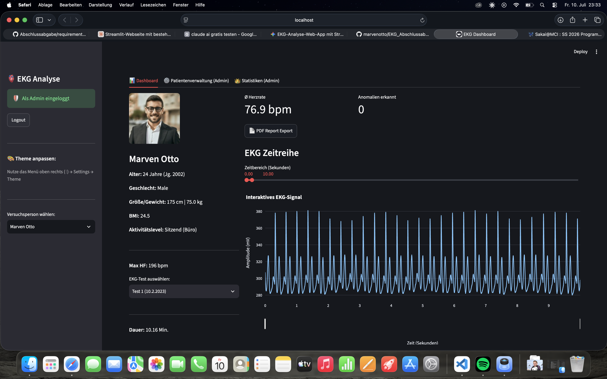
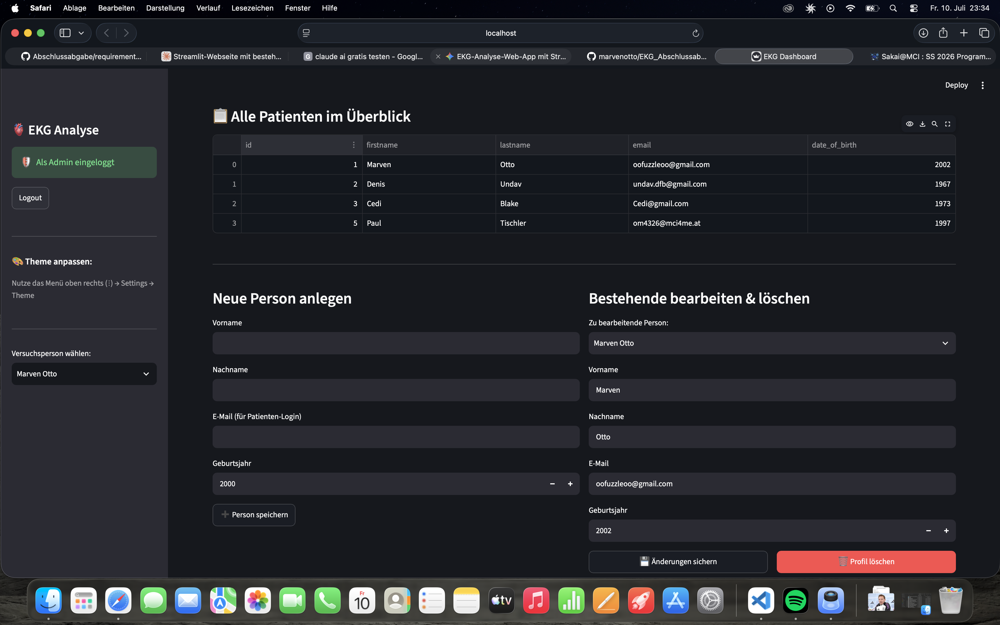
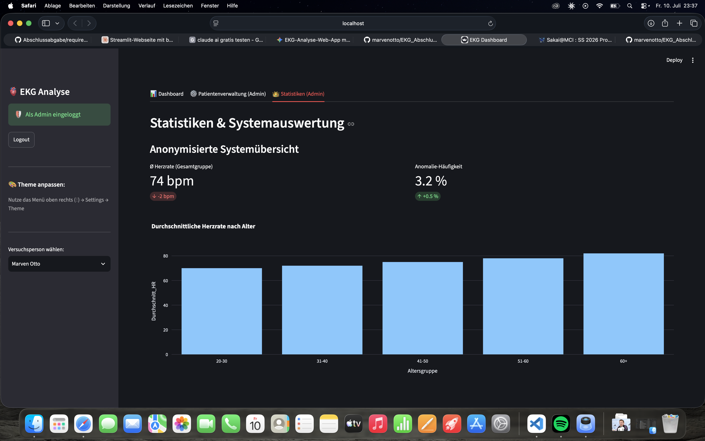

# Interaktives EKG-Analyse-Dashboard mit Streamlit

Ein modularer, datenschutzkonformer Prototyp zur biosignalanalytischen Auswertung, Visualisierung und Verwaltung von Elektrokardiogramm-Zeitreihen (EKG). Das System bietet rollenbasierte Zugänge für Patienten und Administratoren, automatisierte Anomalie-Erkennung sowie einen automatischen PDF-Report-Export.

---

## Autoren
* **Cedric Rissi**
* **Marven Otto**

---

##  Unsere Features

### 👤 Patienten-Bereich
* **Automatisches Onboarding:** Erstregistrierung inklusive vollständiger Erfassung demografischer und anthropometrischer Parameter (Gewicht, Größe, Aktivitätslevel, BMI-Berechnung).
* **Interaktive Signal-Visualisierung:** Dynamische EKG-Kurvenanzeige mittels Plotly inklusive performantem Downsampling zur flüssigen UX und einem integrierten Range-Slider.
* **Self-Service & Upload:** Eigenständiges Hochladen von neuen EKG-Messdaten (CSV/TXT) und Aktualisierung des Profilbilds direkt über das Webinterface.
* **Anonymer Gruppenvergleich:** Datenschutzkonformer Vergleich der eigenen durchschnittlichen Herzfrequenz mit aggregierten Referenzwerten anderer Altersgruppen.
* **PDF-Export:** Generierung eines standardisierten klinischen EKG-Untersuchungsberichts.

### 🛡️ Admin-Bereich (CRUD)
* **Patientenverwaltung:** Vollständige Einsicht in die zentrale Patientendatenbank (person_db.json).
* **Datenmanipulation (CRUD):** Erstellen neuer Patientenakten, tiefgreifendes Bearbeiten bestehender Stammdaten und restloses Löschen von Profilen.
* **Systemstatistiken:** Aggregierte, anonymisierte Systemauswertung (z. B. Anomalie-Häufigkeiten und demografische Verteilungen).

---

## 🔑 Zugangsdaten für die Patienten Profile und Admin

### 1. Administrator-Zugang
* **Reiter im Interface:** 🛡️ Admin Zugang
* **Benutzername:** admin
* **Passwort:** admin123

### 2. Patienten-Zugänge (Vorkonfiguriert)
* **Reiter im Interface:** 🔑 Patienten Login
* **Passwort für Testaccount:** 12345

**Verfügbare Test-Akten:**
 **Test-Account:** oofuzzleoo@gmail.com

* **Marven Otto:** marvenotto@gmail.com
* **Denis Undav:** undav.dfb@gmail.com
* **Cedi Blake:** Cedi@gmail.com

*Hinweis zum Self-Service:* Jederzeit können über den Reiter "📝 Registrieren" neue, vollwertige Patienten-Accounts inklusive automatisiertem Profil-Onboarding von Grund auf neu erstellt werden.

---

## Installation und Inbetriebnahme (Für Prüfer & Neueinsteiger)

Diese Anleitung führt Sie Schritt für Schritt durch die lokale Installation des Dashboards. 

### Voraussetzung
* **Python 3.8** oder höher muss auf dem System installiert sein.
* Ein Code-Editor, idealerweise **Visual Studio Code (VS Code)**.

### Schritt 1: Projekt herunterladen
1. Klicken Sie auf GitHub oben rechts auf den grünen Button **"<> Code"**.
2. Wählen Sie **"Download ZIP"**.
3. Entpacken Sie die ZIP-Datei und öffnen Sie den entstandenen Ordner `EKG_Abschlussabgabe` in **VS Code**.

### Schritt 2: Terminal öffnen & Umgebung vorbereiten
1. Öffnen Sie in VS Code das integrierte Terminal (`Ansicht` -> `Terminal` oder Shortcut `Cmd + J` am Mac / `Strg + J` bei Windows).
2. Erstellen Sie eine virtuelle Python-Umgebung, um Konflikte zu vermeiden. Tippen Sie ein:

    python3 -m venv .venv

*(Hinweis für Windows-Nutzer: Falls python3 nicht funktioniert, nutzen Sie nur python)*

3. Aktivieren Sie die Umgebung:
   * **Mac / Linux:** `source .venv/bin/activate`
   * **Windows:** `.venv\Scripts\activate`
   *(Sobald erfolgreich, steht ein (.venv) vorne in Ihrer Terminal-Zeile).*

### Schritt 3: Bibliotheken installieren
Installieren Sie alle benötigten Pakete mit folgendem Befehl:

    pip install -r requirements.txt

### Schritt 4: E-Mail Secrets konfigurieren (WICHTIG!)
Da das System ein echtes E-Mail-Verfahren zur Registrierung nutzt, benötigt Streamlit eine lokale Secrets-Datei (diese wird aus Sicherheitsgründen nicht auf GitHub hochgeladen).
1. Erstellen Sie im Hauptordner (`EKG_Abschlussabgabe`) einen neuen Ordner namens `.streamlit` (mit Punkt am Anfang!).
2. Erstellen Sie in diesem Ordner eine Datei namens `secrets.toml`.
3. Fügen Sie folgenden Inhalt in die `secrets.toml` ein (Sie können für den Testzweck auch Dummy-Daten eintragen, E-Mail-Versand funktioniert dann jedoch nicht):

email = "oofuzzleoo@gmail.com"
password = "caoefminvcgduktf"

### Schritt 5: Applikation starten
Tippen Sie den Startbefehl in das Terminal ein:

    streamlit run app.py

Ihr Standard-Webbrowser öffnet sich nun automatisch unter `http://localhost:8501` und das Dashboard ist einsatzbereit!

---

## Systemarchitektur & Dateistruktur

Das Projekt folgt einer strikten Schichtentrennung (Modularisierung), um Wartbarkeit und Erweiterbarkeit für die Medizintechnik-Software zu garantieren:

    EKG_Abschlussabgabe/
    │
    ├── app.py                  # Zentraler Einstiegspunkt (Streamlit-UI & Routing)
    ├── requirements.txt        # Externe Abhängigkeiten und Bibliotheken
    ├── pyproject.toml          # Projekt-Metadaten und Konfiguration
    │
    ├── .streamlit/             # Lokale Konfiguration (muss manuell erstellt werden)
    │   └── secrets.toml        # Zugangsdaten für SMTP E-Mail Server
    │
    ├── data/                   # Dateibasierte NoSQL-Datenbanken (JSON/CSV)
    │   ├── person_db.json      # Medizinische Patientenakten & EKG-Verknüpfungen
    │   ├── users.json          # Verschlüsselte Login-Credentials & Verifizierungsstatus
    │   ├── ekg_data/           # EKG-Rohdatensätze (.txt / .csv)
    │   └── pictures/           # Profilbilder der Patienten
    │
    └── src/                    # Anwendungslogik (Backend-Module)
        ├── __init__.py         # Initialisierung des Quellcode-Pakets
        ├── auth.py             # Authentifizierung, SHA-256-Hashing & SMTP-Mail-Logik
        ├── models.py           # Objektorientierte Datenmodelle (Person, EKG)
        ├── processing.py       # Biosignalanalyse & Peak-Detektion mittels NeuroKit2
        ├── visualization.py    # Generierung interaktiver Plotly-Diagramme
        └── pdf_generator.py    # PDF-Generierung und Binärdaten-Verarbeitung (fpdf)

---

## Verwendete Kern-Bibliotheken

* **Streamlit:** Framework für das Webinterface und die reaktive UI-Steuerung.
* **NeuroKit2:** Fortschrittliche Biosignalanalyse zur präzisen Detektion von R-Zacken und Herzratenberechnung.
* **Plotly Express:** Erstellung interaktiver, explorativer Zeitreihen-Diagramme.
* **FPDF:** Programmatische Generierung valider PDF/A-Konformer Untersuchungsberichte.
* **Pandas & NumPy:** Hochperformante Verarbeitung und Filterung tabellarischer Messdatenstrukturen.